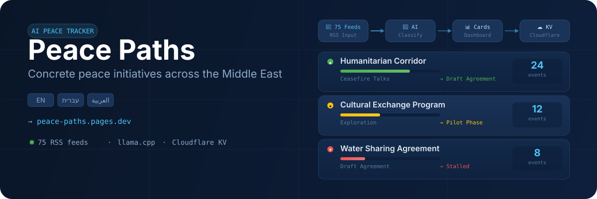
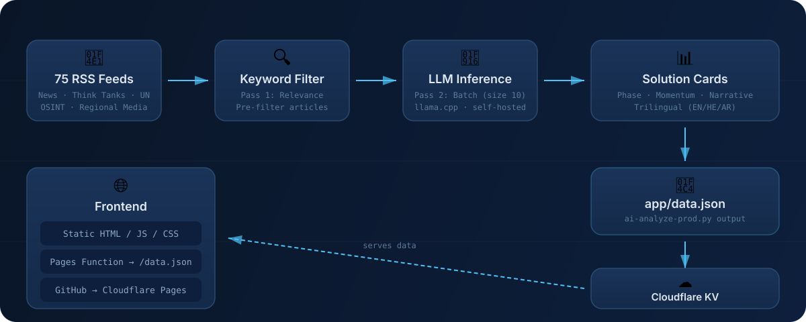

<p align="center">
  
</p>

---

<p align="center">
  <strong>AI-Powered Peace Tracker</strong> · <a href="https://peace-paths.pages.dev">Live Dashboard</a> · <a href="#architecture">Architecture</a> · <a href="#getting-started">Getting Started</a>
</p>

---

Peace Paths monitors **75 RSS feeds** across the Middle East, classifies articles with a self-hosted LLM, and groups them into **solution cards** showing phase progression, momentum, and event counts — in **three languages** (English, Hebrew, Arabic).

Each tracked initiative shows where it stands: from active conflict through ceasefire talks, draft agreements, and signed deals — or whether momentum is stalling.

## Key Features

| Feature | Detail |
|---------|--------|
| **75 RSS feeds** | Regional news, think tanks, UN sources, OSINT |
| **Two-pass AI** | Keyword pre-filter → batch LLM classification (size 10) |
| **Solution cards** | Phase tracking · Momentum scoring · Narrative summaries |
| **Trilingual** | English · עברית · العربية (LLM-translated with domain glossary) |
| **Self-hosted** | llama.cpp on local network · no external API keys for inference |
| **Real-time** | Hourly fast updates · Daily full refresh · Auto-refresh every 15 min |

---


## Architecture



```
75 RSS Feeds → Keyword Filter → LLM (llama.cpp) → Solution Cards → data.json → Cloudflare KV
                                                                                      ↓
                                                                            Frontend (Pages)
```

| Component | Technology |
|-----------|------------|
| AI inference | llama.cpp (self-hosted, local network) |
| AI model | Configurable via `AI_MODEL` (default: `Qwen3.6-27B`) |
| Frontend | Static HTML/JS/CSS (trilingual) |
| Data storage | Cloudflare KV (`peace-data`) |
| Data delivery | Cloudflare Pages Function (`/data.json`) |
| Hosting | Cloudflare Pages (auto-deploy from GitHub) |

---

## Getting Started

### Prerequisites

- Python 3.10+
- Node.js + npm (for Wrangler)
- A llama.cpp server running on your local network

### Setup

```bash
# Clone and enter
git clone https://github.com/ErezIsrael/peace-paths.git
cd peace-paths

# Configure environment
cp .env.example .env
# Edit .env: LLAMA_CPP_URL, AI_MODEL, CLOUDFLARE_API_TOKEN, CLOUDFLARE_ACCOUNT_ID

# Configure feeds and categories
cp rss-feeds.example.json rss-feeds.json
cp categories.example.json categories.json
```

### Local Development

```bash
# Active development (port 8769)
cd dev-environment && python dev-serve.py

# Test against real AI data (port 8766)
cd test && python dev-serve.py
```

### Running the AI Pipeline

```bash
# Quick update — last 2 hours, merges into existing data
python ai-analyze-prod.py --fast

# Full run — 7-day window, overwrites data
python ai-analyze-prod.py --daily

# Local only — skip KV upload
python ai-analyze-prod.py --fast --skip-upload

# Keyword only — skip LLM inference
python ai-analyze-prod.py --fast --fetch-only
```

### Deploy Data to Cloudflare KV

```bash
npx wrangler kv key put "data.json" \
  --namespace-id=badf4fb7acfe4d1c905db77ed8d5e70f \
  --path="app/data.json" --remote
```

---

## Automated Updates

| Task | Schedule | Script |
|------|----------|--------|
| `PeacePaths-FastUpdate` | Every hour | `auto-fast-update.bat` |
| `PeacePaths-DailyUpdate` | Daily at 2 AM | `auto-daily-update.bat` |

Registered via `setup-tasks.ps1` (Windows Task Scheduler).

---

## Project Structure

```
peace-paths/
├── ai-analyze-prod.py          # Production AI pipeline (two-pass, trilingual)
├── categories.json             # Solution categories
├── rss-feeds.json              # 75 feed URLs
├── prompts.json                # AI prompts
├── source-profiles.json        # Source bias mappings
├── app/                        # Live frontend → GitHub → Cloudflare Pages
│   ├── index.html              # lang="he" dir="rtl"
│   ├── app.js                  # Frontend logic
│   ├── styles.css              # Alternating card colors, narratives
│   └── translations.json       # Trilingual UI strings
├── functions/
│   └── data.json.js            # Pages Function — serves from KV
└── admin/                      # Admin panel (local only)
```

---

<p align="center">
  <a href="https://github.com/oil-oil/beautify-github-readme">
    
  </a>
</p>

---

[MIT License](LICENSE)
